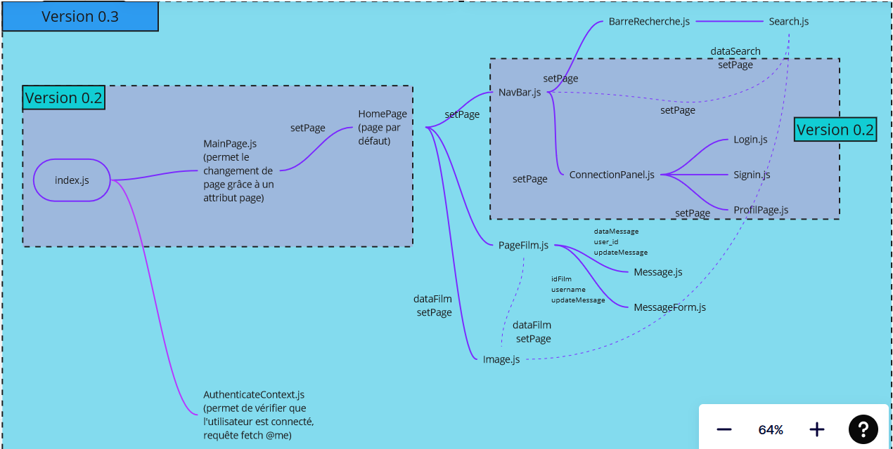
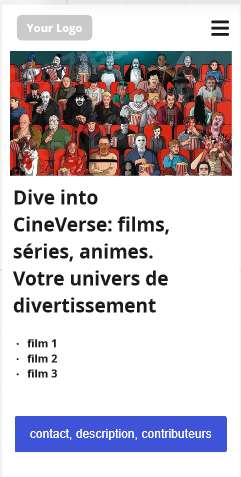
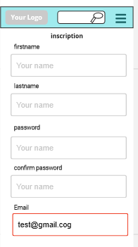
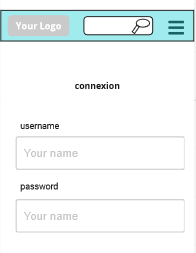
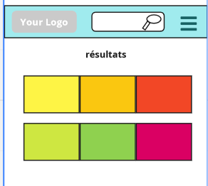
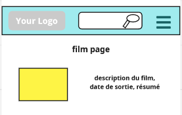
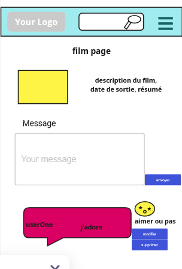

#WireFrames
## features 1 : navigation pour l'utilisateur. 
**page d'acceuil**
visualisation des films tendances, barre de navigation 

**page de connexion**

## feature 2 : recherche et filtre
**page qui affiche les résultats de la recherche**

**page film**

## feature 3 et petite feature 4 : commentaire (suppression, modification, création d'une table dans la bdd, création d'un commentaire sur la page film)
