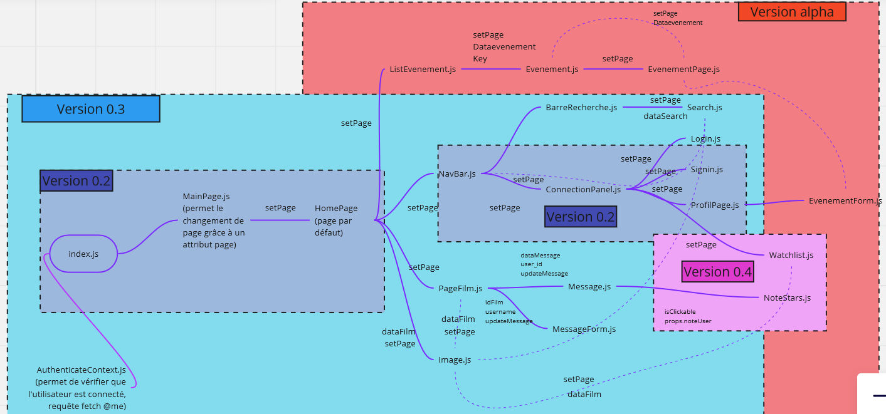
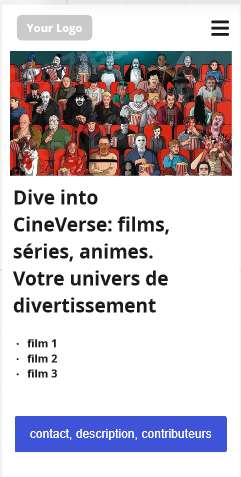
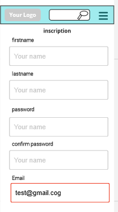
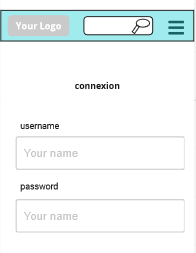
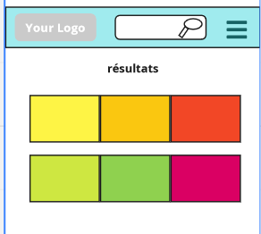
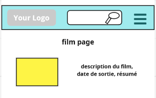
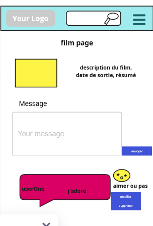

#Cinéverse  
## Equipe 
- Lea Dornat  
- Mouna Lisa Saadi  
- Vanessa Martin  

Cinéverse est un projet qui vise à transformer l'expérience cinématographique en combinant la passion pour le cinéma avec les dernières avancées technologiques. Ce projet consiste en la création d'un site web dédié à la critique de films, enrichi d'un système de recommandation basé sur un chatbot intelligent.

Il s'adresse à une audience diversifiée, allant des cinéphiles passionnés aux novices cherchant à découvrir des recommandations de film ou encore des associations de cinémas qui pourront organiser des évènements et partager leur passion.

##Motivation 
Le projet que nous entreprenons émane de notre profonde passion pour le monde cinématographique et de la conviction que l'expérience de choisir un film peut être grandement améliorée par l'innovation technologique.

- La profusion de choix de films disponible aujourd'hui crée un défi pour les amateurs de cinéma lorsqu'il s'agit de trouver des films qui correspondent à leurs goûts personnels. Cinéverse vise à résoudre ce problème en utilisant un chatbot intelligent pour simplifier le processus de recommandation, prenant en compte les préférences individuelles de l'utilisateur.  
- Cinéverse s'efforce de personnaliser l'expérience de chaque utilisateur comprenant ses préférences uniques, en s'adaptant à ses humeurs changeante en suggérant des films qui correspondent à sa palette cinématographique spécifique.  
- Au-delà de la recommandation de films, nous aspirons à créer une communauté cinéphile dynamique. Cinéverse offre un espace intéractif où les utilisateurs peuvent partager leurs critiques, recommandations et expériences, favorisant ainsi une discussion active et une paticipation communautaire.  

#Concurrence 

|**Critères**|**Allociné**|**Télérama**|**Cinéverse**|
| - | - | - | - |
|**Plateforme Technique**|Site Web, Application Mobile|Site Web|Site Web|
|**Système de Recommandation**|Basé sur les notes et avis des utilisateurs|Axé sur les préférences de films d'auteur, genres spécifiques|Système de recommandation avec chatbot intelligent|
|**Contenu**|Critiques courtes, horaires de séances, bandes-annonces|Critiques détaillées, analyses approfondies|Critiques variées, analyses, contenu pédagogique|
|||||

|**Approche Éditoriale**|Orienté divertissement, informations sur célébrités|Axé sur l'art cinématographique, films moins commerciaux|Équilibré entre divertissement et contenu artistique|
| :- | :- | :- | :- |
|**Événements et Festivals**|Couverture des sorties grand public, festivals populaires|Axé sur les festivals de films d'auteur, indépendants|Présentation de films variés, festivals internationaux|
|**Système de Chatbot**|Non|Non|Intégration d'un chatbot intelligent|
|**Public Cible**|Cinéphiles de tous niveaux, grand public|Cinéphiles exigeants, amateurs de films d'auteur|Public diversifié, passionné de cinéma|
|**Avantage Cineverse**|Intégration d'un chatbot intelligent pour des recommandations personnalisées|Accent sur la qualité artistique, analyses approfondies|Système de recommandation innovant avec chatbot|

**Personas: Amateur de film**

**CONTEXTE**

Pierre est un passionné de cinéma et il aime donner son avis et partager ses nouvelles découvertes. Cineverse lui paraît idéale pour partager son expérience et découvrir de nouveaux films.

Pierre peut rechercher avec Cineverse les films qu’il l’aimerait regarder et ainsi consulter les avis des utilisateurs. Il obtient sur Cineverse des commentaires pertinents avec la note relative au film.

Pierre apprécie pouvoir donner son avis et échanger avec les autres utilisateurs. Cineverse permet de réunir des personnes autour d’intérêts communs et favorise l’organisation d’événement en lien avec cette passion commune.

Pierre est très content de pouvoir découvrir de nouveau film avec cette application web, elle valorise le patrimoine français en plus.

Pierre peut également localiser les cinémas proches de lui, ce qui lui permet d’aller au cinéma plus souvent.

Pierre peut aussi organiser ses idées avec Cineverse afin de lui permettre de donner un avis plus pertinent et ou de créer ses propre scénario.

**BUTS ET COMPORTEMENTS**

- Pierre se connecte à Cineverse avec ses identifiants et mots de passe sur un page s’accueille commune à tous les utilisateurs même ceux qui n’ont pas de compte.  
- Pierre peut rechercher un film avec la barre de recherche. La barre de recherche lui fait des propositions en cas d’oubli du nom de film.  
- Pierre peut accéder à la page d’un film, visualiser la bande annonce, les commentaires, la description et mettre un avis via un formulaire. Pour accéder à la page d’un film il suffit de cliquer sur l’affiche ou le nom du film après avoir fait sa recherche ou après avoir consulter sa liste de favoris ou la liste des suggestions du moment. La page du film permet aussi de montrer sur quelle plateforme de streaming le film est disponible.  
- Pierre peut noter le film via des pictogrammes.
- Pierre peut revenir à tout moment sur l’une des pages qu’il a consulté grâce à un historique.  
- Pierre dispose d’une barre de navigation qui le suit à chacune des pages qu’il consulte. Cette barre de navigation est composée d’un menu déroulant, de la barre de recherche et d’information sur son profil et d’un lien de déconnexion sinon par défaut des liens vers les pages de connexion et d’inscription.  
- Pierre peut consulter son profil et le modifier. Il peut également suivre d’autres utilisateurs. Il peut créer des groupes de discussion où rejoindre des groupes de discussion en recherchant les groupes dans la barre de recherche ou avec le bouton créer un groupe dans le menu. Pour créer un groupe, il sera obligatoire de choisir un thème de discussion.  
- Pierre peut aussi accéder aux statistiques du site afin de se rendre compte de la fiabilité de ce dernier.  
- Pierre peut s’abonner pour soutenir le site.
- Pierre peut consulter les cinémas les plus proches sur une carte. (interaction avec google map peut-être).  
- Pierre peut consulter les associations inscrites sur le site et suivre les événements qu’elles organisent.  
- Pierre peut également consulter l’assistant virtuel lorsqu’il a besoin de conseil sur quelle film choisir.  

**CE QUE CELA IMPLIQUE**

Un espace pour Pierre pour partager sa passion du cinéma avec l’utilisation de symboles et de commentaire pour partager son avis.

Un accès sécuriser à son compte avec un mot de passe et un identifiant. Une navigation sur le site facilité par une barre de navigation.

La possibilité de retrouver ses recherches avec un historique.

Pierre peut facilement trouver le cinéma le plus proche.

Pierre peut créer un communauté autour d’un film en créant un groupe. (exemple:

réunion pour aller au cinéma voir ce film, penser à une option pour la suppression du groupe).

**Personas: Une association**

**CONTEXTE**

Anna est la présidente d’une association de cinéma. Elle veut faire connaitre son association afin de s’agrandir et de pouvoir partager les événements que sont associations créées.

Anna veut un moyen facile de partager ses avis, ses recommandations et un moyen de discuter facilement avec les membres de l’association.

Elle veut pouvoir avoir un support pour organiser ses projets et les partagés. 

**BUTS ET COMPORTEMENTS**

- Anna peut avec Cineverse crée un compte pour son association. Elle peut ajouter des membres à son association dans l’onglet du profil de l’association dans la zone organisation.  
- Anna peut créer un groupe spécifique à l’association. Elle peut sur la page de profil de l’association partager des événements que sont association organise. Elle peut demander de l’aide sur certain projet.  
- Anna comme un amateur de cinéma peut partager son avis sur certains films en utilisant des commentaires sur la page du film ou en utilisant des pictogrammes.  
- Anna peut supprimer des membres de son association et en ajouter.  

**CE QUE CELA IMPLIQUE**

Cela implique de créer un profil unique pour les associations. De créer une catégorie événement dans laquelle on retrouverait tous les événements organisés par les associations.

Cela implique d’avoir la liste des associations qui se sont inscrites sur le site. Cela implique aussi de créer un espace organisation sur un profil association.

**Architecture Technique**

1. Backend - Python :  

Le backend est implémenté en langage Python avec l’utilisation du framework flask.

- Framework Web - Flask
- Organisation en Package : Le code est structuré en deux principaux packages :  
  - Package Back-End : Responsable de la gestion des utilisateurs, des recommandations, et des interactions avec la base de données.  
    - Package API : Organisé par app.py pour les requêtes provenant du frontend.  
    - Base de Données : Notre base de données de film est issu d’un système externe et notre base de données d’utilisateurs ( recommendation) sera réalisée manuellement à travers un questionnaire. 
  - Package Client : Il contient tous les composants et permet d'avoir une interface adapté aux utilisateurs.   
- Tests Unitaires : Les tests unitaires seront réalisés en utilisant des frameworks tels que Mockito et JUnit pour garantir la robustesse du backend. Des mocks seront créés pour simuler divers scénarios, assurant ainsi la fiabilité des fonctions essentielles.  
- Tests d'API REST : Les tests d'API REST seront effectués pour vérifier la cohérence des points d'extrémité et la manipulation correcte des données entre le frontend et le backend. On utilise l'API Swagger (pas encore mise en place) pour faire des test et également Postman.   

2. Frontend - React avec JSON :  
- Bibliothèque Frontend - React : Pour le développement du frontend, nous utiliserons React pour sa flexibilité et sa facilité d'intégration avec des API REST.  
  - Communication avec l'API : Le frontend interagira avec le backend via des appels d'API REST, échangeant des données au format JSON pour une communication efficace et légère.  
  - Librairies HTTP - Fetch et Axios : Pour effectuer des requêtes HTTP depuis le frontend, nous avons choisi d'utiliser deux librairies populaires : Fetch et Axios.  
- Organisation en Package : Le frontend est structuré en plusieurs packages triés en fonction de la catégorie de composants.  
- Tests d'Interface : Les tests d'interface seront effectués à l'aide de frameworks tel que Jest , garantissant la fonctionnalité correcte des composants React et une expérience utilisateur sans faille.  

3. Tests Bonus:  
- Tests de Base de Données : Des tests spécifiques seront mis en place pour évaluer la robustesse de la base de données, couvrant la gestion des erreurs, les transactions, et la cohérence des données.  

#Livraison 1 : Version 0.2 
##WireFrames
**page d'acceuil**
La page d'accueil permet de visualiser des films tendances et de naviger graçe à une barre de navigation. On estime son coût à moins d'une livraison. 

**page de connexion**
La page de connexion permet à l'utilisateur de s'inscrire ou de se connecter avec son compte. 

On a également lors de cette livraison un back bien fourni avec des fonctionalités diverses. 

#Livraison 2 : Version 0.3
**page qui affiche les résultats de la recherche**
Nous avons créer un interface pour que l'utilisateur puisse avoir accès aux résultats de sa recherche et faire d'autre recherche avec la barre de navigation. 

**page film**
La page de film permet d'afficher toutes les informations relatives au film qui intéresse l'utilisateur. 

## feature 3 et petite feature 4 : commentaire (suppression, modification, création d'une table dans la bdd, création d'un commentaire sur la page film)
L'utilisateur a également la possibilité d'ajouter un commentaire sur la page du film pour partager son avis avec la communauté de Cinéverse.

#Livraison 3 : Version 0.4 
**Like et note**
L'utilisateur peut commenter les commentaires des autres avec un système de like. 

L'utilisateur peut également noter le film. La note du film repose sur la moyenne de la note de tous les commentaires. 
**Bande annonce**
L'utilisateur peut visionner la bande annonce du film depuis la page du film. 

L'utilisateur peut également ajouter le film à sa watch liste pour le retrouver plutard. 

#Livraison 4 : Version Alpha 
**Evenement**
L'utilisateur peut créer des événements auxquelle d'autre utilisateurs pourront participer. Cela reste à améliorer. 
Dans cette livraison nous avons aussi mis en place l'API Swagger, une route pour réinitialiser son mot de passe, mis à jour le diagramme des composants. 

## Arborescence du projet 
Structure du dossier pour le volume OS
Le numéro de série du volume est BA98-D3E2
C:.
└───ProjetM1-DevOps
    ├───.github
    │   └───workflows
    ├───back-end
    │   ├───instance
    │   ├───migrations
    │   │   ├───versions
    │   │   └───__pycache__
    │   ├───venv
    │   │   
    ├───client
    │   ├───public
    │   └───src
    │       ├───commentaire
    │       ├───connexion
    │       ├───evenements
    │       ├───pages
    │       └───search
    └───images